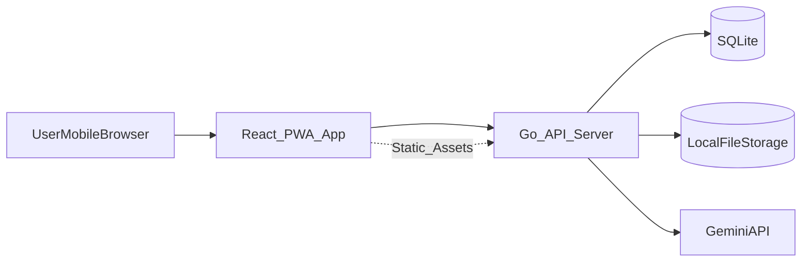
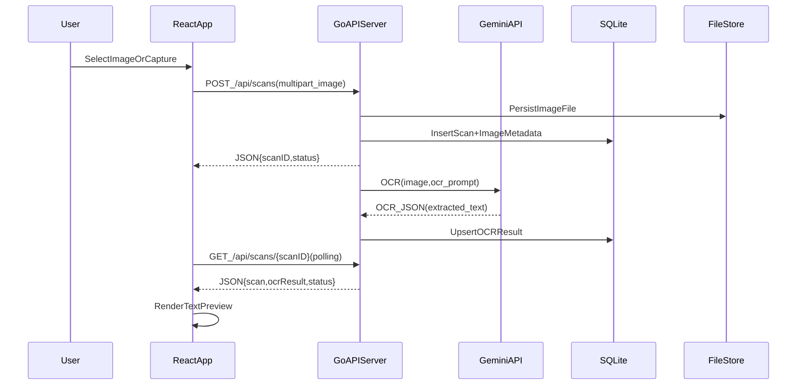
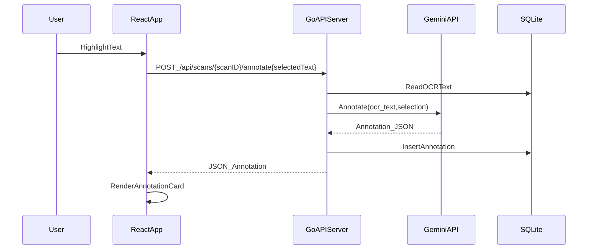
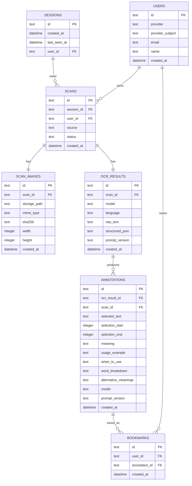

## RFC: Mobile-first PWA OCR+Annotation (Go + React + Gemini)

### Status
Draft - Migrated from HTMX to React

### Summary
Build a **mobile-first PWA** that lets users **upload/take a photo of a Japanese book page**, runs **Gemini Flash OCR** to extract text, then lets users **highlight words/sentences** to get **contextual professional/work explanations** (meaning, usage example, when to use, word breakdown, alternative meanings).

### Goals
- **Fast OCR**: image → readable text preview (target OCR success rate ≥ 85% per PRD)
- **Core value loop**: highlight → annotation within ≤ 3 seconds on average (PRD)
- **Mobile UX first**: React-driven UI optimized for touch selection and quick iteration
- **Persistence**: scans and annotations persist across sessions (session-based in Phase0)

### Non-goals (Phase0)
- Google OAuth (Phase1)
- Bookmark/history UI (Phase2)
- Offline OCR/annotation (PWA only caches shell/assets; API calls require network)
- Native apps, realtime live scanning, handwriting, quizzes (PRD out of scope)

### Scope
#### Phase0 (now): PRD 7.1.2 ImageCaptureUpload + 7.1.3 TextInteractionAnnotation
- **Input**: upload from gallery (and optionally capture via browser camera input)
- **OCR**: Gemini Flash vision OCR to extract Japanese text
- **Text preview**: show extracted text, allow selecting/highlighting
- **Annotation**: Gemini generates structured fields for highlighted text
- **Identity**: anonymous **session cookie** (no login)

#### Phase1 (next): PRD 7.1.2 AppEntryAuthentication
- Google OAuth sign-in
- Associate existing session data to a user upon login

#### Phase2 (next): PRD 7.1.4 BookmarkHistory
- Save/bookmark annotations
- Scan history + annotation history pages

### User experience (Phase0 happy flow)
- User opens app (PWA)
- User chooses **Upload** (or capture)
- App shows **OCR processing** state
- App shows **Text Preview**
- User highlights a word/sentence
- App shows **Annotation Result** with required fields
- User can highlight another phrase (loop)

### Architecture
#### Components
- **PWA client**: React SPA with shadcn/ui components, Tailwind CSS v4, optimized for mobile selection UX
- **Go web server**: API backend serving JSON responses; serves React static files in production
- **Gemini API client**: two calls
  - **OCR**: image → extracted text JSON
  - **Annotation**: extracted text + selection → structured annotation JSON
- **SQLite**: metadata + OCR text + annotations (Phase0); users/bookmarks later
- **File storage**: store uploaded images on disk (e.g. `data/uploads/`), DB stores path + hashes

#### PWA strategy
- `manifest.webmanifest` for installability
- Service worker caches the app shell + static assets for faster repeat loads
- OCR/annotation endpoints are **network-only** (no offline compute)

#### Gemini integration
- **Model**: Gemini Flash for OCR (vision) and annotation (text)
- **Output format**: JSON-first prompts so backend can store and render reliably
- **Prompt versioning**: store `prompt_version` with OCR/annotation for later iteration

### API surface

#### JSON API Endpoints (React Frontend)
- **POST /api/scans**: multipart upload, returns JSON `{"scanID": "...", "status": "uploaded", "createdAt": "..."}`
- **GET /api/scans/{id}**: returns JSON `{"scan": {...}, "ocrResult": {...} | null, "status": "..."}`
- **POST /api/scans/{id}/annotate**: accepts JSON `{"selectedText": "..."}`, returns annotation JSON
- **GET /api/scans/{id}/image**: returns binary image data
- **GET /healthz**: basic health check

#### Legacy HTMX Endpoints (for backward compatibility)
- **GET /**: home/upload entry (HTMX)
- **POST /scans**: multipart upload, create scan, start OCR, redirect to scan page (HTMX)
- **GET /scans/{scanID}**: text preview + highlight UI (HTMX fragments for updates)
- **POST /scans/{scanID}/annotate**: accepts selection payload, returns annotation fragment (HTMX)

### Data model
#### Diagrams








#### SQLite schema (DDL)
```sql
PRAGMA foreign_keys = ON;

-- Phase0 identity: anonymous session (cookie) with optional future user association
CREATE TABLE IF NOT EXISTS sessions (
  id TEXT PRIMARY KEY,
  user_id TEXT NULL,
  created_at TEXT NOT NULL,
  last_seen_at TEXT NOT NULL,
  FOREIGN KEY (user_id) REFERENCES users(id)
);

-- Phase1: Google OAuth users
CREATE TABLE IF NOT EXISTS users (
  id TEXT PRIMARY KEY,
  provider TEXT NOT NULL,
  provider_subject TEXT NOT NULL,
  email TEXT NULL,
  name TEXT NULL,
  avatar_url TEXT NULL,
  created_at TEXT NOT NULL,
  UNIQUE(provider, provider_subject)
);

-- Phase0 scan records
CREATE TABLE IF NOT EXISTS scans (
  id TEXT PRIMARY KEY,
  session_id TEXT NOT NULL,
  user_id TEXT NULL,
  source TEXT NOT NULL,      -- camera|upload
  status TEXT NOT NULL,      -- uploaded|ocr_done|failed
  created_at TEXT NOT NULL,
  FOREIGN KEY (session_id) REFERENCES sessions(id),
  FOREIGN KEY (user_id) REFERENCES users(id)
);

CREATE TABLE IF NOT EXISTS scan_images (
  id TEXT PRIMARY KEY,
  scan_id TEXT NOT NULL UNIQUE,
  storage_path TEXT NOT NULL,
  mime_type TEXT NOT NULL,
  sha256 TEXT NULL,
  width INTEGER NULL,
  height INTEGER NULL,
  created_at TEXT NOT NULL,
  FOREIGN KEY (scan_id) REFERENCES scans(id) ON DELETE CASCADE
);

CREATE TABLE IF NOT EXISTS ocr_results (
  id TEXT PRIMARY KEY,
  scan_id TEXT NOT NULL UNIQUE,
  model TEXT NOT NULL,
  language TEXT NULL,
  raw_text TEXT NOT NULL,
  structured_json TEXT NULL,
  prompt_version TEXT NOT NULL,
  created_at TEXT NOT NULL,
  FOREIGN KEY (scan_id) REFERENCES scans(id) ON DELETE CASCADE
);

-- Phase0 annotations (generated from highlight selections)
CREATE TABLE IF NOT EXISTS annotations (
  id TEXT PRIMARY KEY,
  scan_id TEXT NOT NULL,
  ocr_result_id TEXT NOT NULL,
  selected_text TEXT NOT NULL,
  selection_start INTEGER NULL,
  selection_end INTEGER NULL,
  meaning TEXT NOT NULL,
  usage_example TEXT NOT NULL,
  when_to_use TEXT NOT NULL,
  word_breakdown TEXT NOT NULL,
  alternative_meanings TEXT NOT NULL,
  model TEXT NOT NULL,
  prompt_version TEXT NOT NULL,
  created_at TEXT NOT NULL,
  FOREIGN KEY (scan_id) REFERENCES scans(id) ON DELETE CASCADE,
  FOREIGN KEY (ocr_result_id) REFERENCES ocr_results(id) ON DELETE CASCADE
);

-- Phase2 bookmarks
CREATE TABLE IF NOT EXISTS bookmarks (
  id TEXT PRIMARY KEY,
  user_id TEXT NOT NULL,
  annotation_id TEXT NOT NULL,
  created_at TEXT NOT NULL,
  FOREIGN KEY (user_id) REFERENCES users(id) ON DELETE CASCADE,
  FOREIGN KEY (annotation_id) REFERENCES annotations(id) ON DELETE CASCADE,
  UNIQUE(user_id, annotation_id)
);

CREATE INDEX IF NOT EXISTS idx_scans_session_id_created_at ON scans(session_id, created_at);
CREATE INDEX IF NOT EXISTS idx_scans_user_id_created_at ON scans(user_id, created_at);
CREATE INDEX IF NOT EXISTS idx_annotations_scan_id_created_at ON annotations(scan_id, created_at);
CREATE INDEX IF NOT EXISTS idx_bookmarks_user_id_created_at ON bookmarks(user_id, created_at);
```

### Frontend Architecture

#### React App Stack
- **Package Manager**: Bun (fast installs, built-in test runner)
- **Build Tool**: Vite (fast HMR, optimized production builds)
- **Language**: TypeScript
- **UI Framework**: React 18+
- **Component Library**: shadcn/ui (Tailwind v4 compatible)
- **Styling**: Tailwind CSS v4 (via `@tailwindcss/vite` plugin)
- **Testing**: Vitest (with React Testing Library, target ≥80% coverage)
- **Routing**: React Router v6
- **Data Fetching**: TanStack Query (React Query) for API calls
- **State Management**: React Query + Context API (minimal global state)
- **PWA**: Vite PWA Plugin
- **Form Handling**: React Hook Form

#### Component Structure
```
src/
├── pages/                    # Page components
│   ├── HomePage.tsx
│   ├── ScanPage.tsx
│   └── NotFoundPage.tsx
├── components/
│   ├── ui/                  # shadcn/ui components
│   ├── homepage/            # HomePage-specific components
│   └── scanpage/            # ScanPage-specific components
├── hooks/                    # Custom React hooks
├── lib/                      # Utilities, API client, types
└── test/                     # Test setup and utilities
```

#### Build Integration

**Development**:
- React dev server runs on `http://localhost:5173` (Vite default)
- Go server runs on `http://localhost:8080`
- Vite proxy configured to forward `/api/*` to Go server

**Production**:
- React app builds to `web/frontend/dist/` (via `bun run build`)
- Go server serves static files from `web/frontend/dist/` directory
- Go server handles `/api/*` routes, everything else serves React app (SPA routing)

### HTMX vs React Comparison

#### HTMX Approach

**Pros**:
- Minimal JavaScript bundle size (~10KB)
- Server-side rendering, fast initial page loads
- Simple mental model: HTML + attributes
- Progressive enhancement (works without JS)
- Less build tooling complexity
- Direct server-to-HTML rendering, fewer round trips

**Cons**:
- Limited interactivity for complex UIs
- Difficult state management for complex flows
- Smaller ecosystem compared to React
- Mobile text selection requires custom JavaScript
- Less component reusability
- Harder to implement complex animations/transitions
- Limited TypeScript support

#### React Approach

**Pros**:
- Rich ecosystem (shadcn/ui, React Query, etc.)
- Excellent state management solutions
- Component reusability and composition
- Strong TypeScript support
- Better mobile UX libraries and patterns
- Modern tooling (Vite, HMR, etc.)
- Easier to implement complex interactions
- Large community and resources

**Cons**:
- Larger JavaScript bundle (~100-200KB gzipped)
- More complex build setup
- Requires build step for production
- More abstraction layers
- Client-side rendering (slower initial load potentially)
- More dependencies to manage

#### Migration Rationale

For this PWA with mobile-first design and need for shadcn/ui components, **React was chosen** because:
1. Mobile text selection UX benefits from React's component model
2. shadcn/ui provides excellent mobile-optimized components
3. Better state management for complex annotation flows
4. TypeScript support improves maintainability
5. PWA can cache React bundle effectively

### Tasks
#### Phase0: Core happy flow (7.1.2 ImageCaptureUpload + 7.1.3 Annotation)
- [x] Add base Go web server (router, templates, static assets)
- [x] Migrate to React frontend
  - [x] Setup Bun workspace and React app with Vite
  - [x] Install Tailwind CSS v4 and shadcn/ui
  - [x] Create React components (HomePage, ScanPage, components)
  - [x] Implement custom hooks (useScan, useAnnotation, useTextSelection)
  - [x] Setup API client and TypeScript types
- [x] Add JSON API endpoints
  - [x] POST /api/scans
  - [x] GET /api/scans/{id}
  - [x] POST /api/scans/{id}/annotate
- [x] Legacy HTMX endpoints (for backward compatibility)
  - [x] Home/upload page
  - [x] Scan page with text preview
  - [x] Annotation fragment returned via HTMX
- [ ] Implement session cookie identity
  - [ ] Create/read session cookie
  - [ ] Update `sessions.last_seen_at`
- [ ] Implement image upload handling
  - [ ] Validate mime/size
  - [ ] Persist image to local storage
  - [ ] Create `scans` + `scan_images` rows
- [ ] Gemini Flash OCR
  - [ ] OCR prompt (JSON output with extracted text)
  - [ ] Store `ocr_results` (raw_text + structured_json + prompt_version)
  - [ ] OCR failure handling + retry UX
- [ ] Text preview UI
  - [ ] Render extracted text with selection guidance for mobile
  - [ ] Capture selection payload (selected_text, optional start/end offsets)
- [ ] Annotation generation
  - [ ] Annotation prompt constrained to PRD output fields
  - [ ] Parse + validate response
  - [ ] Store `annotations`
  - [ ] Render result (Meaning, Usage Example, When to Use, Word Breakdown, Alternative Meanings)
- [ ] Performance + safety
  - [ ] Timeouts and request size limits
  - [ ] Basic rate limiting per session (optional for MVP)
  - [ ] Logging + correlation IDs per scan

#### Phase1: Authentication (7.1.2 AppEntryAuthentication)
- [ ] Google OAuth flow (login, callback, logout)
- [ ] `users` table population + uniqueness rules (provider, subject)
- [ ] Session-to-user association (on login)
- [ ] Protect user-specific pages/endpoints where needed

#### Phase2: Bookmark & history (7.1.4 BookmarkHistory)
- [ ] Save bookmark action on annotation result
- [ ] Bookmarks page (list by date/time) + detail view
- [ ] Scan history page (list scans) + scan detail
- [ ] Annotation history (optional: per scan and global)